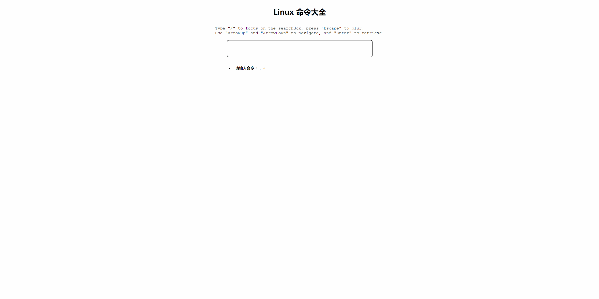

# Knowledge base management tool md file retrieval

This is a web application for retrieving md files and rendering them to web pages. It can also give search suggestions based on the keywords you enter. It can be used as your md file management tool.

这是一个用于检索 md 文件并渲染到网页的 Web 应用，并且能够根据你输入的关键词给出搜索建议，可以很好地作为你的 md 文件管理工具。

## Manual

**Note that this manual works for both Windows and Linux users.**

First, you should download NodeJS, my version is v20.11.1, and add node and npm to you PATH.

And then download the project and download the following packages in the project directory:

`npm install markdown-it --save`,

`npm install express --save`.

Then you may find your project structure like this:

```shell
.
├── commands
├── main.js
├── node_modules
├── package.json
├── package-lock.json
├── static
└── templates
```

Next, you can change line 8 in `main.js` with relative path to your directory of md files (default is "commands").

And then run `node main.js` in your terminal, and go to `127.0.0.1:5000` in your browser and you will see the app, if your port is occupied, change it in line 41 in main.js:`app.listen(5000...` and rerun `node main.js`.

#### Add md files

This tool is originally used for Linux commands retrieval, but it can do much more!

You can add your own md files in the `commands` dir (or your own md dir).

And then you should add some info in `static/index.js`:

```json
"conda": {
  "n": "conda",
  "d": "包管理工具"
},
```

Your md file should be named `conda.md` and it should stay the same with the key and "n" property, the "d" property is how you want the app to retrieve your data, e.g. you can type "包管理" and you can find "conda" in you search suggestions.

## Example


